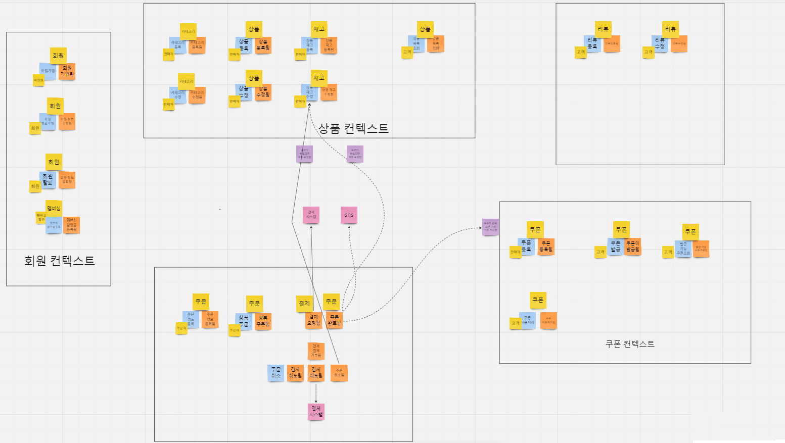

## 프로젝트 소개

간단한 쇼핑몰 프로젝트 입니다. 관리자,회원, 카테고리, 상품, 재고, 쿠폰, 주문, 리뷰 기능으로 구성 되어있습니다.

어드민 서버, API 서버, 정산, 정산 서버로 구성되어 있으며 각각은 멀티 모듈로 구성 되어있습니다.

비즈니스 도메인 중심으로 서비스를 모델링하고 변경에 유연한 구조로 작성하였습니다.

각 도메인의 처리 결과는 카프카 이용하여 비동기로 다른 도메인으로 알려 주도록 구성하였습니다

## Project Overview

### 시스템 구조

### 모듈 구조

<aside>
💡 admin-front 모듈은 현재 미구현 중입니다.

</aside>

## 사용 기술

---

- java 17, Spring boot 3.1.3, Spring Data JPA, Mapstruct, Lombok, Gradle, JJWT
- h2, mysql, Redis, Kafka 6.2.0
- Docker, Docker Compose, Akhq

## 요구 사항

---

해당 서비스의 주요 이해 관계자는 다음과 같다

1. 유저 - 서비스를 통해 상품을 선택하여 주문하는 고객
2. 관리자 - 해당 서비스를 운영하고 관리하는 담당자
3. 해당 서비스의 주요 도메인은 다음과 같다
    1. 관리자 - 카테고리, 상품, 재고, 쿠폰 할인 정책 등 쇼핑몰 운영에 필요한 정보들을 등록한다.
    2. 유저
        - 회원 가입과 로그인을 가능하면 상품 조회하고 주문 결제 할 수 있다.
        - 멤버십 할인율 정책 관리 하고 주문 시 멤버십 할인율에 따라 추가 할인을 받을 수 있다.
        - 쿠폰을 발급 받아서 상품 주문 시 할인 받을 수 있다.
    3. 상품
        - 카테고리, 상품, 상품의 옵션 정보 등록하고 관리함
        - 동시에 주문이 요청되어도 정합성이 유지 되어야 한다.
    4. 재고
        - 관리자는 상품 옵션 별 재고 수량을 등록 할 수 있다.
    5. 주문
        - 유저가 선택한 상품 정보와 주문 정보를 관리하고 할인 금액 계산 및 결제 처리함.
        - 할인 금액 정책은 쿠폰 할인관 멤버십 할인이 있으며 각 할인 정책을 계산 할 앞 단계 할인 금액이 적용된 가격에서 계산해야 한다.
          예) 가격1 = 상품 가격 - 쿠폰 할인 금액
          최종 가격 = 가격1 - (가격1 \* 멤버십 할인율)
    6. 쿠폰
        - 고정된 금액 할인과 비율(%)로 할인이 있다
        - 관리자는 상품 별 쿠폰을 등록 할 수 있다.
        - 유저는 쿠폰을 발급 받아 주문 시 할인 받을 수 있다.
    7. 리뷰
        - 주문한 상품이 배송 완료되면 리뷰를 작성 할 수 있다.

## 설계

---

1. 이벤트 스토밍

   

2. 컨텍스트 맵핑

   

## 상품 서비스

- 관리자는 상품 필요한 정보 카테고리, 상품, 재고 등을 등록 수정 삭제를 한다.
- 사용자는 상품과 연관된 정보를 조회 할 수 있다.
- 상품 도메인 모델

### 상품 도메인 모델

### 카테고리

상품의 카테고리를 관리하는 도메인입니다. 계층적인 구조를 가지고 이기 때문에 경로 열거하는 방법으로 구현 하였다.

- 부모의 path가 1/4 이고, 자신의 아이디가 7이면 자신의 path는 ‘1/4/7’ 이 된다
- 1/4의 하위 카테고리를 검색 하고 싶으면 ‘path LIKE '1/4/%/’ 같이 검색하면 된다.
- 카테고리 도메인 UML
  
- \***\*API Lists\*\***
    1. admin

       

    2. API

       

### 상품

상품의 정보, 옵션, 이미지 등과 카테고리 맵핑 정보를 관리 한다.

- 주문 도메인 UML

  

- Item Aggregate 와 실제 상품과 옵션 값의 예시 매핑은 아래와 같다

  

\***\*API Lists\*\***

1. admin
   
2. API

   

### 재고

- Inventory 는 item의 옵션 별 재고 수량을 관리 한다.
- Inventory 주문 시 나 주문 취소 시 재고 변경 시 동시성 문제를 해결 하기 위해 Redisson Client 을 이용 하여 Aop 기반 분산 락을 적용하여서 동시성 문제를 해결 하였다.

    - Redisson은 Pub/Sub 방식을 이용하기에 락이 해제되면 락을 subscribe 하는 클라이언트는 락이 해제되었다는 신호를 받고 락 획득을 시도하게 됩니다.
    - DBMS의 락 기능을 사용하는 것에 비해 별도의 인프라의 구축 해야 하는 단점이 있지만 Redis 가 성능이 우수하다

- 주문 도메인 UML
  
- API Lists
    1. admin

       

    2. API

       

## 쿠폰 서비스

관리자는 쿠폰 할인 정책을 등록과 이를 적용할 상품을 등록한다

할인 정책에는 고정 금액 할인과 고정 비율 정책이 있다.

유저는 쿠폰을 발급 받아 주문 시 할인을 받는다.

### 쿠폰 할인 정책

JPA 상속 기능을 이용하여서 공통 정보는 추상 class 인 Coupon Class에 넣고 구체적인 할인 정책 정보는 구현체에 들어 있다.

1. Coupon 에는 공통 정보(쿠폰 이름, 적용 상품 리스트. 만료일 등) 관리
2. AmountCoupon: 고정 금액 할인 정책 관리
3. RateCoupon : 비율 할인 정책 관리

### 할인 쿠폰

- 유저가 발급 받은 쿠폰 정보를 (쿠폰 Id, 유저 Id, 만료일 등) 관리 한다.

### 쿠폰 UML

### 쿠폰 발급 UML

### API

- admin
  
- api
    - 쿠폰 등록
      
    - 쿠폰 발급
      

### 주문 서비스

- 주문 정보를 등록
    - 주문할 상품 정보 수량, 할인 쿠폰 등
- 등록한 주문을 결제를 요청한다.
    - 결제 요청의 유효성 검사를 한 후 주문을 결제 요청을 한다.
    - 성공 시 Kafka 결제 완료 메시지를 보내고 이를 받아 이벤트를 처리한다.
        - 쿠폰 사용 처리, SMS 메시지
- 결제한 주문을 취소 할 수 한다.
    - 결제한 주문을 취소 요청을 한다.
    - 성공 시 Kafka 결제 취소 메시지를 보내 이를 받아 이벤트를 처리한다.
        - 쿠폰 사용 처리, SMS 메시지, 재고 증가
- 주문 상태를 조회 할 수 있다.
- 구현 간소화를 위해 결제 연동, 주문 취소, 배송 정보 연동, SMS 메시지 연동을 제외한다.

### 주문 도메인 UML

### 구현

1. 주문 결제

- 주문 생성 요청 시 주문 할 유저, 상품, 할인 쿠폰 정보를 등록 한다.
- 결제 요청 시 결제 요청 유효성 검사를 한 후 재고 차감한 후 선택한 결제 수단으로 결제를 시도한다
- 결제가 완료 되면 kafka 로 주문 완료 메시지 publishing 이를 Cosuming 하여 쿠폰 사용 처리, SMS 메시지 처리를 한다.
- Tranaction이 commit 되어야지 kafka 로 주문 완료 메시지를 publishing 하게 하였습니다.

2. 주문 취소

- 주문 취소가 가 완료 되며 kafka 로 주문 완료 메시지 publishing 이를 Cosuming 하여 쿠폰 사용 처리 취소, 재고 증가, SMS 메시지 처리를 한다.
- Tranaction이 commit 되면 kafka로 주문 완료 메시지를 publishing 한다.

1. PaymentProcessor 중심으로 한 결제 호출 다이어그램

    - 결제 처리의 세세한 구현은 Service 가 아니라 PaymentProcessor 클래스에 위임하고, Service 도메인에서는 이를 활용하기 위한 Interface 를 선언 하고 사용한다
    - DIP 개념을 활용하여 도메인이 사용하는 Interface 의 실제 구현체를 주입 받아(Injection) 사용할 수 있도록 한다
    - PaymentApiCaller interface 을 아래와 같이 메서드 시그니처를 선언 하고, 결제 수단 구현체를 생성하고, PaymentProcessorImpl class에서 결제 수단에 맞게 결제 수단
      구현체를 선택하여 결제 처리를 한다.

   

2. DiscountCalucalor 을 중심으로 할인가 계산 다이어그램

    - 여러 어그이거트를 참조하거나 한 어그리거트에 넣기 다소 복잡한 로직 일 경우 도메인 서비스인 DiscountCalucalor 에게 위임하고 Order 어그리게트에 전달하였고 Order는 세부 적인 가격
      정보을 가지고 있는 OrderItem에게 할인 가격 계산 책임을 할당하였다.
    - 서비스 레이어에서 DiscountCalucalor Interface 실제 구현체를 주입 받아 어그이거트의 메소드를 실행 할 때 DiscountCalucalor 구현체는 파라미터로 전달한다.
    - 각 할인 정책(멤버십, 쿠폰) 을 계산을 책임을 DiscountCalculatorDecorator 에게 할당하고 각 구현체가 멤버십 할인, 쿠폰 할인 금액을 계산한다.
    - 앞 단계 계산 결과를 반영하기 위해 andThen 메소드를 체이닝한다. (Decorator 패턴)
    - CouponCalculator 는 아래와 같은 메서드 시그니처를 선언 하고, 이들 각 쿠폰 할인 정책에 맞는 구현체 구현 생성하고 쿠폰 할인 정책에 맞게
      CouponDiscountCalculatorDecorator class 에서 CouponCalculator Interface 의 구현체를 선택하여 쿠폰 할인 금액을 계산한다.

   

   ### API

   

   ### 리뷰 서비스

   주문이 구매 확정되면 각 구매 상품의 리뷰를 작성 할 수 있다.

   ### 리뷰 UML

   

   ### API

   

   ## \***\*Service Endpoint\*\***

    - Adminserver
        - [http://localhost:8091/](http://localhost:8091/)
    - Api server
        - [http://localhost:8081/](http://localhost:8091/)
